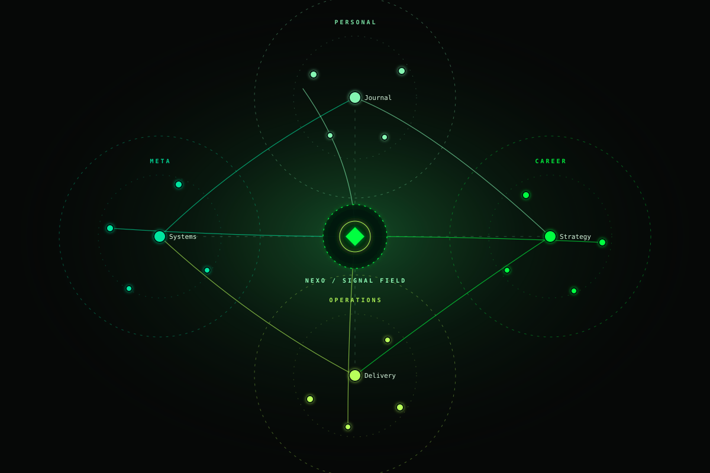

# Nexo Graph

**A graph view with its own signal.** Nexo Graph maps the links between your Markdown notes into a dark, luminous network with four configurable green groups.

[Latest release](../../releases/latest) · [Nexo theme](https://github.com/tiagovilasboas/obsidian-nexo) · [Report an issue](../../issues)

[Changelog](CHANGELOG.md)

[](https://buymeacoffee.com/tiagovilasboas)



## What it does

- Opens a dedicated graph view from the ribbon or command palette.
- Reads Markdown files and resolved links through Obsidian's public plugin API.
- Places notes in four visual groups based on one or more folder prefixes; unmatched notes form a neutral center.
- Supports case-insensitive search highlighting by note name or path, with a live match count and an explicit no-match message, plus zoom and drag to pan.
- Filters groups and can focus on notes connected to the last active note at one, two, or three link hops.
- Highlights a note's neighbors on hover/focus, shows link direction, and offers a context-menu action to open a note.
- Keyboard users can open that context menu with **Shift+F10** or the Context Menu key while a note is focused; reciprocal links share one edge with arrows at both ends.
- On a focused note, **Enter** opens it, **Space** selects or deselects it and its neighbors, and **Escape** clears selection and search. Selection remains visible after keyboard focus moves.
- Keeps group settings in the vault's plugin data and updates when files are created, edited, renamed, or removed and when Obsidian refreshes link metadata.
- Supports vault-specific ignored path prefixes so trash and archived backups can stay out of the visualization without changing notes; the footer reports the excluded count.

## Signal Field

Signal Field is Nexo Graph's visual language: four folder domains orbit a neutral Nexo core, with quiet contours and curved links that make cross-domain relationships readable before every label is visible. Cross-domain links travel through deterministic sector lanes that stay outside the core and title exclusion zones, separating them from quieter links within a domain. The layout is deterministic, so a note stays in the same territory between renders. The preview above uses invented fixture data only; it contains no vault content.

The graph uses a deterministic layout that adapts each group's radius to its note count. For large vaults, it shows up to 500 notes: within each folder group, notes are ranked by link count and selected in round-robin passes so a large group cannot hide smaller groups. It shows up to 1,600 links, selected in passes across observed group pairs; cross-group links come first, then endpoint link count and path order break ties. The footer reports when either cap applies. In graphs with 32 or more visible notes, labels are considered in degree order up to four per group and estimated collisions suppress lower-priority labels; search matches and the focused note reveal their labels on demand. The footer legend only lists populated groups, while filters keep empty groups visible with a zero count. Zoom and pan remain available to inspect crowded groups. It does not modify notes, Obsidian's native Graph settings, or `.obsidian/graph.json`.

## Palette

| Group | Default folder prefix | Color |
| --- | --- | --- |
| Personal | `pages/pessoal/` | Mint `#84f5b2` |
| Career | `pages/carreira/` | Signal `#00ff41` |
| Operations | `pages/ops/` | Lime `#b8ff5a` |
| Meta | `pages/meta/` | Aqua `#00e5a0` |

Change each group's name, one or more comma-separated prefixes and color, and set ignored paths in **Settings → Community plugins → Nexo Graph**. Only groups with matching notes occupy a labeled Signal Field domain; unmatched notes stay neutral near the core. A folder prefix classifies and colors notes; it does not create graph edges. Connections come from Obsidian's resolved Markdown links, such as `[[checkout]]`. Nexo Graph works without the Nexo theme, though the two share a palette.

Use the group toggles above the graph to focus on selected areas. Search matches notes in the current graph scope and announces the match count, including when no notes match. Open Nexo Graph while viewing a note, then choose **Local** and a hop depth to explore its neighborhood.

## Install

1. Download `manifest.json`, `main.js`, and `styles.css` from the [latest release](../../releases/latest).
2. Put them in `<your-vault>/.obsidian/plugins/nexo-graph/`.
3. In Obsidian, turn on community plugins and enable **Nexo Graph**.
4. Choose **Open Nexo Graph** in the command palette or click its ribbon icon.

Version 0.1.0 was an early preview. Version 0.2.1 introduced filters and local exploration; 0.3.0 improved graph sampling; 0.4.0 adds multi-prefix folder groups. Community plugin gallery submission is planned; until then, install manually. The manifest includes the funding link for the future listing.

**Release status:** the latest published GitHub release is still **0.3.0**. The repository `main` branch and manifest are at **0.4.0**, but those assets have not been published as a GitHub release yet. The “Latest release” download therefore does not include the 0.4.0 changes. Keep `main.js`, `manifest.json`, and `styles.css` from one version together; do not mix release assets.

## Privacy and architecture

All rendering happens locally inside Obsidian. The plugin has no network calls, analytics, bundled dependencies, or access to private Graph internals. It uses `getMarkdownFiles()` and `metadataCache.resolvedLinks` from the public API, and only writes its own group settings.

The plugin source lives in `src/`; the dependency-free `node scripts/bundle.mjs` command generates the self-contained `main.js` that Obsidian loads. Edit `src/main.js`, `src/graph-engine.js`, and `styles.css` when developing locally.

### Local quality checks

Run the same checks used by GitHub Actions before opening a pull request:

```sh
node --check src/main.js
node --check src/graph-engine.js
node scripts/bundle.mjs --check
node --test tests/*.test.js
node scripts/check-css-contract.mjs
node scripts/check-manifest.mjs
node scripts/check-api-compatibility.mjs
node scripts/graph-visual-metrics.mjs
```

## Support and feedback

Support development of Nexo Graph on [Buy Me a Coffee](https://buymeacoffee.com/tiagovilasboas), or use [Issues](../../issues) for bugs and ideas.

Nexo Graph is original software distributed under the [MIT license](LICENSE).
